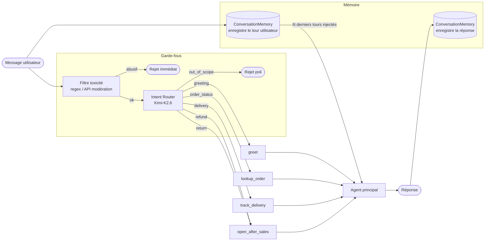

# Diagnostic des conversations problématiques

Source : `data/conversations_problematiques.json`

---

## Catégories identifiées

Deux familles de défauts distincts :

1. **Oublis** — défaut de mémoire intra-session
2. **Sorties de rôle** — requêtes hors périmètre, toxiques, ou mal routées

---

## Oublis

### `ctx-oubli-1` — Perte de contexte sur deux tours

L'agent ne se souvient plus de la commande 4521 mentionnée au premier tour après avoir traité la commande 4490.

**Mécanisme défaillant** : l'historique de conversation n'est pas transmis dans chaque appel LLM. Ce n'est pas un système de mémoire complexe qui manque, mais simplement l'accumulation des `{role, content}` passés à l'API à chaque tour.

**Distinction importante** : il s'agit de mémoire *intra-session* (dans la même conversation), pas de mémoire persistante inter-sessions. La solution est d'inclure tous les tours précédents dans le tableau `messages` à chaque appel.

**Système existant** (`src/velmo/memory.py`) : `ConversationMemory` avec fenêtre glissante de 8 tours. Deux défauts :

- `history()` fait `_turns[:self.window]` → retourne les 8 **premiers** tours, pas les 8 derniers. La fenêtre ne glisse pas : passé le 8e tour, l'agent perd tout le contexte récent et ne voit plus que le début de la conversation.
- La taille de fenêtre (8) est arbitraire et non exposée à la configuration de l'agent.

**Options de correction** :

- **Option A — corriger `ConversationMemory`** : remplacer `_turns[:self.window]` par `_turns[-self.window:]` et augmenter la fenêtre (16–20 tours). Simple, sans dépendance supplémentaire, suffisant pour de la mémoire intra-session.
- **Option B — `MemorySaver` de LangChain** : checkpointer intégré avec persistance par `thread_id`. Justifié uniquement si une mémoire inter-sessions ou une intégration LangGraph est nécessaire.

---

## Sorties de rôle

### `perimetre-1` et `perimetre-2` — Requêtes hors périmètre

Recette de cookies, conseil boursier : sujets sans rapport avec les commandes et livraisons Velmo.

**Mécanisme manquant** : un classifier d'intention en entrée qui détecte que la requête est hors périmètre et rejette avec un message poli, avant même d'invoquer l'agent principal.

Note : le système prompt seul peut couvrir ces cas, mais un guardrail séparé est préférable pour isoler les responsabilités et ne pas exposer le modèle principal à des entrées hors sujet.

---

### `entree-abusive-1` — Entrée toxique

Insulte directe ("imbécile").

**Mécanisme manquant** : un filtre de toxicité en amont, sans LLM. Options :

- **Regex + normalisation** (suppression des accents, leetspeak) — couvre les variantes orthographiques simples
- **API de modération dédiée** (ex. Perspective API) — petit modèle spécialisé, production-ready, coût et latence négligeables

Un LLM général est disproportionné pour ce cas (coût, latence).

---

### `apres-vente-1` — Demande de remboursement

Requête légitime mais nécessitant un routage vers un sous-parcours spécifique.

**Mécanisme manquant** : le même classifier d'intention que pour `perimetre-`*, mais exploité pour router vers le bon sous-parcours plutôt que pour rejeter. Le composant est identique ; c'est l'action résultante qui diffère selon l'étiquette produite.

---

## Routing d'intention

**Système existant** (`src/velmo/flow.py`) : `classify()` par correspondance de mots-clés (`_KEYWORDS`, 11 entrées), `route()` mappe l'intent vers l'outil. Deux bugs :

- `_KEYWORDS` mappe "retour"/"remboursement" vers `"after_sales"` mais `Intent` n'a pas de valeur `after_sales` → `Intent("after_sales")` lève un `ValueError` à l'exécution (les intents `RETURN` et `REFUND` ne sont plus atteignables).
- `agent.py` n'appelle pas `route()` — `llm.complete` est invoqué directement dans tous les cas, le routing vers les outils métier est donc inopérant.

**Correction** : ajouter `AFTER_SALES = "after_sales"` à `Intent`, supprimer `RETURN`/`REFUND`, mettre à jour `_ROUTES`, et brancher `route()` dans `agent.py`.

## Flow existant

Bugs visibles sur ce schéma — tous dans le code existant, rien à ajouter :

- **Mémoire non injectée** : `agent.py` enregistre les tours dans `ConversationMemory` mais passe `[]` à `llm.complete` — l'historique n'atteint jamais le modèle. C'est la cause directe de `ctx-oubli-1`. Correction : remplacer `[]` par `self.memory.history()` dans `agent.handle()`.
- **Fenêtre inversée** : `ConversationMemory.history()` fait `_turns[:self.window]` — retourne les 8 premiers tours au lieu des 8 derniers. Sans effet tant que le bug précédent existe, mais à corriger en même temps : `_turns[-self.window:]`.
- **GuardrailError non rattrapée** : `agent.py` n'entoure pas `validate_input()` d'un try/except — l'exception remonte telle quelle au lieu d'un `AgentReply` poli. Correction : attraper `GuardrailError` dans `handle()` et retourner une réponse de refus structurée.
- **Filtre abusif trop strict** : `validate_input` fait `term == lowered` (égalité stricte) — "imbécile" seul est bloqué, pas "tu es imbécile". Correction : remplacer `==` par `in`.
- **`is_in_scope` importé mais jamais appelé** dans `agent.py` — aucun filtre hors-périmètre actif.
- **`route()` jamais appelé** dans `agent.py` — le routing vers les outils métier est inopérant.

---

## Résumé

| Cas                          | Catégorie             | Correction dans le code existant                                                        |
| ---------------------------- | --------------------- | --------------------------------------------------------------------------------------- |
| `ctx-oubli-1`                | Mémoire intra-session | Passer `self.memory.history()` à `llm.complete` + corriger `[:window]` → `[-window:]`  |
| `perimetre-1`, `perimetre-2` | Rejet hors périmètre  | Brancher `is_in_scope()` dans `agent.handle()` et retourner un `AgentReply` de refus   |
| `entree-abusive-1`           | Filtrage toxicité     | Attraper `GuardrailError` dans `handle()` + remplacer `==` par `in` dans `validate_input` |
| `apres-vente-1`              | Routing métier        | Brancher `route()` dans `agent.py` + corriger `Intent` (`AFTER_SALES`) et `_ROUTES`    |

