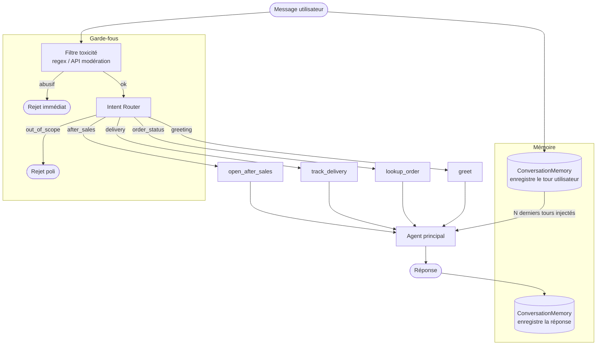

# Flux cible — écarts et non-régression

---

## Flux cible

`return` et `refund` sont regroupés en un seul intent `after_sales`, routé vers `open_after_sales`.



---

## Écarts avec l'existant

### `src/velmo/flow.py`

| Élément | État actuel | État cible |
|---|---|---|
| `Intent` enum | `RETURN`, `REFUND` séparés ; pas de `AFTER_SALES` | Remplacer par `AFTER_SALES = "after_sales"` |
| `_KEYWORDS` | mappe `"retour"/"remboursement"` vers `"after_sales"` (lève `ValueError` car valeur absente de l'enum) | Correct une fois `AFTER_SALES` ajouté à l'enum |
| `_ROUTES` | entrées `RETURN` et `REFUND` vers `open_after_sales` | Remplacer par `AFTER_SALES: "open_after_sales"` |


### `src/velmo/guardrails.py`

| Élément | État actuel | État cible |
|---|---|---|
| `validate_input` | lève `GuardrailError` (exception non catchée dans `agent.handle()`) | retourne un `AgentReply(category="refusal", within_scope=False)` |
| `agent.handle()` | ne catch pas `GuardrailError` — l'exception se propage à l'appelant | vérifie la valeur de retour et retourne le refus immédiatement |

### `src/velmo/memory.py`

| Élément | État actuel | État cible |
|---|---|---|
| `history()` | `_turns[:self.window]` → retourne les N **premiers** tours | `_turns[-self.window:]` → retourne les N **derniers** tours |
| `window` | 8 (valeur trop basse, codée en dur) | 16–20, ou paramétrable via config |

---

## Vérification de non-régression

Les tests existants couvrent déjà les cas de `data/conversations_problematiques.json`. **Aucun nouveau test à écrire** : les tests ont été écrits pour l'état cible et échouent actuellement parce que le code n'a pas encore suivi.

| Cas (`conversations_problematiques.json`) | Test existant | Statut actuel |
|---|---|---|
| `ctx-oubli-1` — fenêtre glissante | `tests/test_memory.py::test_history_keeps_most_recent_turns` | Échec (`[:window]` retourne les premiers tours) |
| `perimetre-1/2` — hors périmètre | `tests/test_scope.py::test_out_of_scope_for_unrelated_question` | À vérifier |
| `entree-abusive-1` — insulte | `tests/test_guardrails.py::test_validate_input_rejects_abusive_message` | À vérifier |
| `apres-vente-1` — remboursement → `after_sales` | `tests/test_flow.py::test_classify_after_sales_for_refund` | Échec (`Intent.AFTER_SALES` absent) |
| `apres-vente-1` — routing → `open_after_sales` | `tests/test_flow.py::test_route_after_sales_to_tool` | Échec (`Intent.AFTER_SALES` absent) |

### Commande de vérification

```bash
pytest tests/test_flow.py tests/test_memory.py tests/test_guardrails.py tests/test_scope.py -v
```

Tous ces tests doivent passer avant de considérer les corrections comme complètes.

---

## Ordre d'implémentation suggéré

1. **`flow.py`** — ajouter `AFTER_SALES` à `Intent`, supprimer `RETURN`/`REFUND`, mettre à jour `_ROUTES`
2. **`memory.py`** — corriger le slice `[-window:]`, corriger 
3. **Vérifier** : `pytest` sur les 5 tests ci-dessus
